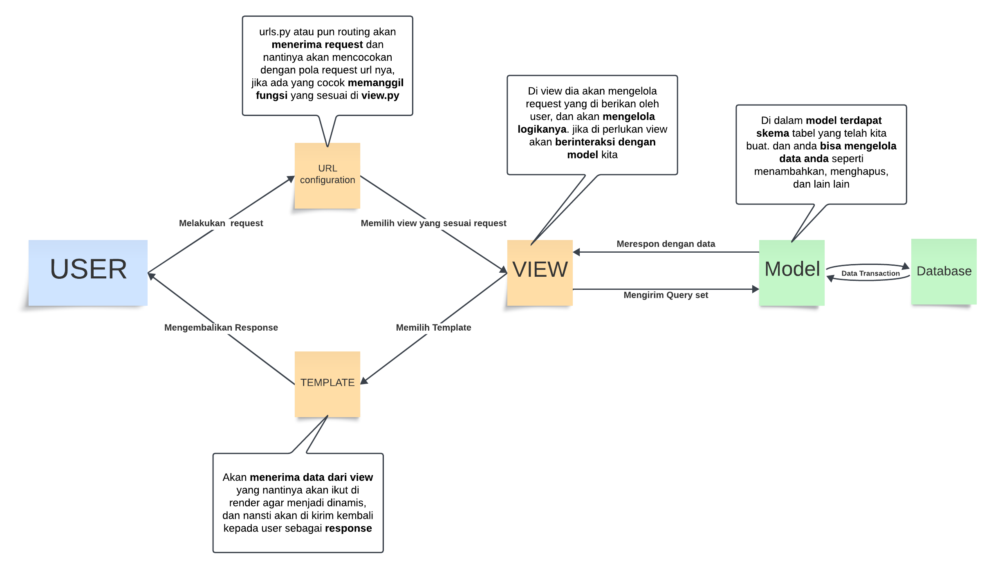

# Ngubin

## PWS

Web dapat diakses melalui <https://hubban-syadid-ngubin.pbp.cs.ui.ac.id//>

## Soal Pengantar

**jelaskan bagaimana cara kamu mengimplementasikan checklist di atas secara step-by-step (bukan hanya sekadar mengikuti tutorial) ?**

> Cara saya untuk mengerjakan tugas 2 ini, bukan hanya mengikuti arahan yang telah diberikan di deskripsi, tapi saya mengeksplorasi lebih dari dokumentasi agar nanti kedepannya saya bukan hanya bisa meniru apps seperti ini tetapi juga dapat memodifikasi sesuai dengan keinginan saya. Hal hal yang saya eksplorasi adalah berhubungan dengan best practice dari Django, built in function apa saja yang bisa saya gunakan, dan sebagainya.

**Buatlah bagan yang berisi request client ke web aplikasi berbasis Django beserta responnya dan jelaskan pada bagan tersebut kaitan antara urls.py, views.py, models.py, dan berkas html ?**

**Jelaskan fungsi git dalam pengembangan perangkat lunak!**

> Git membantu kita untuk melacak perubahan pada kode kita lebih efisien dan ini sangat membantu saya jika sewaktu waktu kode yang saya modifikasi mengalami error dan saya tidak bisa menemukan jalan keluarnya, saya hanya harus kembali ke versi lama dari kode saya yang saya simpan pada github. Bukan hanya itu saja tetapi git juga membantu untuk saya dapat berkolaborasi secara jarak jauh.

**Menurut Anda, dari semua framework yang ada, mengapa framework Django dijadikan permulaan pembelajaran pengembangan perangkat lunak?**

> Django memungkinkan pengguna untuk menggunakan ulang komponen yang telah anda pernah buat sebelumnya untuk keperluan anda, dan mereka juga membuat website yang aman dan ini cocok untuk pemula.

**Mengapa model pada Django disebut sebagai ORM?**

> Dikarenakan Django memiliki fitur untuk website langsung berinteraksi secara langsung dengan database tanpa kalian harus tau cara menggunakan SQL, dan membuat skema tabelnya, abstraksi SQL seperti ini lah yang menjadi fitur daya tarik dari Django.
