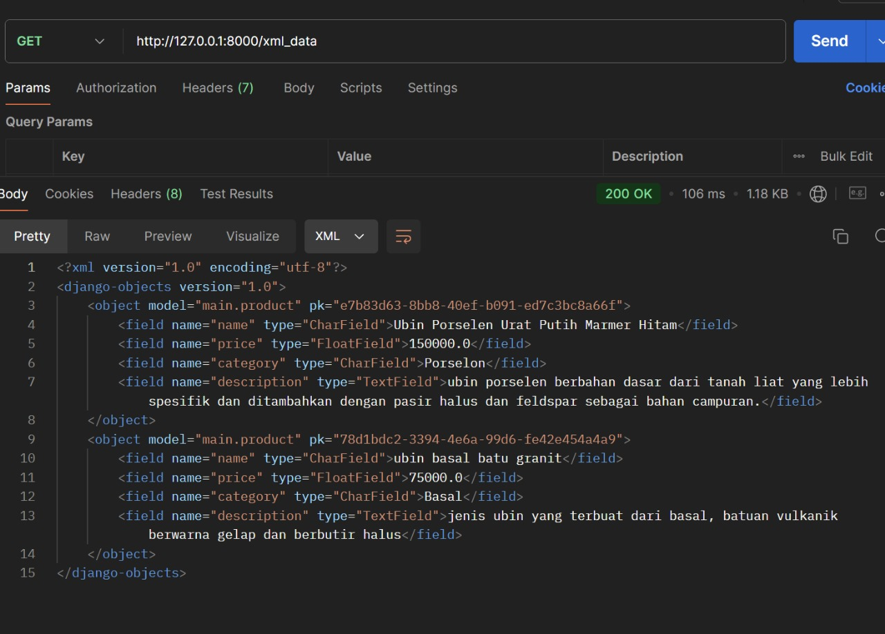
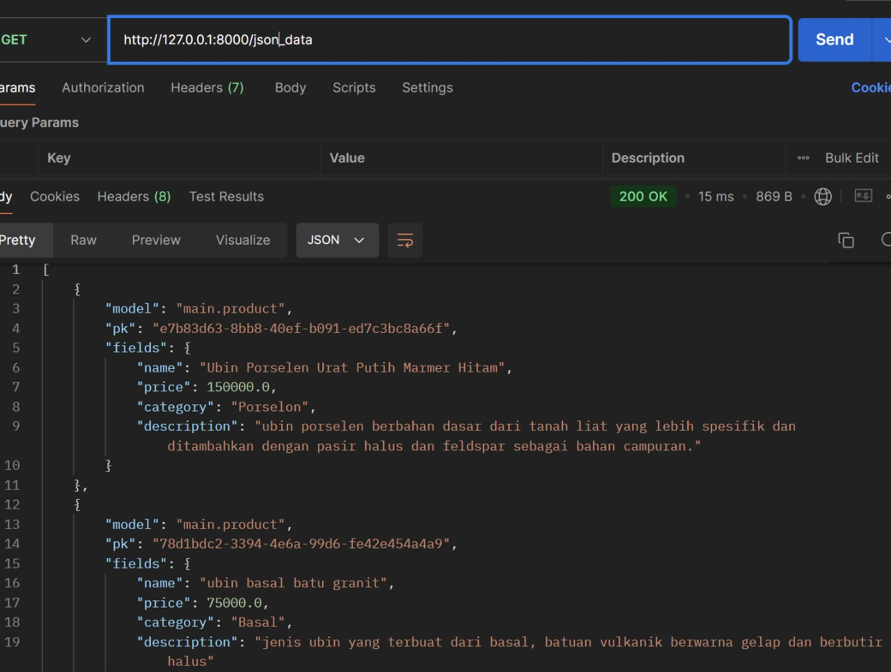
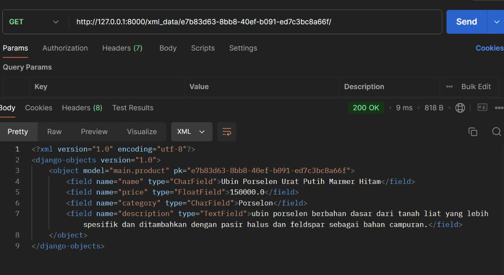
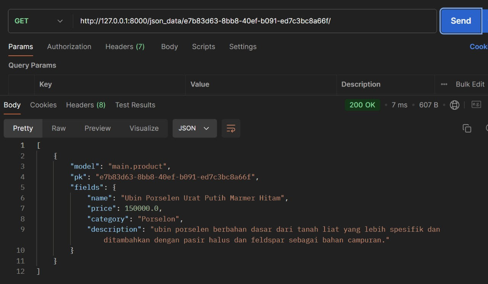

# toko_ngubin

## Link PWS

Web dapat diakses melalui <http://hubban-syadid-ngubin.pbp.cs.ui.ac.id/>

## Jelaskan mengapa kita memerlukan data delivery dalam pengimplementasian sebuah platform?

_Proses data delivery menjadi aspek penting dalam pengembangan sebuah platform
Dikarenakan, seringkali platform yang kita buat ingin berkomunikasi dengan sebuah sistem lain melalui sebuah API dan semacamnya, data delivery memastikan data dikirim dan juga diterima dalam bentuk yang dapat di akses dan diproses oleh berbagai sistem, contoh nya adalah menggunakan XML dan juga JSON._

## Menurutmu, mana yang lebih baik antara XML dan JSON? Mengapa JSON lebih populer dibandingkan XML?

_Dikarenakan format JSOn lebih flexibel dan juga mudah diolah dibandingkan bentuk XML. JSON memiliki struktur yang sederhana dan mudah untuk dibaca oleh manusia.Struktur yang diimplementasikan oleh JSON adalah key-value pair yang mana ini berbeda dengan XML yang memiliki tag penutup dan pembuka. Dari segi parsing pun JSON lebih cepat untuk di parse daripada XML ini berakibat dari strukturnya yang sederhana. Ukuran file json pun biasanya juga lebih kecil jika dibandingkan dengan XML_

## Jelaskan fungsi dari method is_valid() pada form Django dan mengapa kita membutuhkan method tersebut?

_Dikarenakan method ini berfungsi untuk mengecek apakah input yang telah dimasukkan oleh user telah sesuai atau belum dengan kriteria yang telah di kita definisikan dalam form sebelumnya, seperti panjang string maupun angka dalam rentang tertentu.dan jika kiat tidak mengimplementasikan method ini kita tidak bisa memberikan umpan balik kesalahan yang jelas kepada pengguna._

## Mengapa kita membutuhkan csrf_token saat membuat form di Django? Apa yang dapat terjadi jika kita tidak menambahkan csrf_token pada form Django? Bagaimana hal tersebut dapat dimanfaatkan oleh penyerang?

_Pada saat data delivery `csrf_token` di peruntukan untuk aspek keamanan contoh yang dapat membahayakan aplikasi contoh nya adalah serangan CSRF (Cross-Site Request Forgery). Pada serangan ini penyerang bisa saja membuat request yang tampak nya valid dari sumber yang sebenarnya tidak sah. Dan cara kerja dari pun cukup mudah dimengerti dengan menambahkan token CSRF ke dalam formulir, nantinya django bisa memverifikasi apakah kode ini berasal dari sesi pengguna yang sama atau tidak._

_Jika kita tidak menambahkan csrf_token pada form yang kita buat, tentu aplikasi kita akan rentan terhadap serangan CSRF, yang mana ini berbahaya dikarenakan penyerang dapat mengubah pengaturan akun pengguna atau pun melakukan transaksi finansial atau mengirimkan data yang tidak diinginkan tanpa sepengetahuan dari pengguna. Kesimpulan penggunaan `csrf_token` itu penting untuk menghindari eksploitasi data pribadi._

## Jelaskan bagaimana cara kamu mengimplementasikan checklist di atas secara step-by-step (bukan hanya sekadar mengikuti tutorial) ?

1. Saya mengimplementasikan perubahan dengan menambahkan atribut `ID` kedalam model saya, lalu menjalankan `python manage.py makemigrations` dan python `manage.py migrate.`<br>

```from django.db import models
import uuid

# Create your models here.
class Product(models.Model):
    id = models.UUIDField(primary_key=True, default=uuid.uuid4, editable=False)
```

2. Membuat `forms.py` pada direktori main django dan menambahkan model yang telah kita miliki<br>

```
from django.forms import ModelForm
from main.models import Product

class ProductForm(ModelForm):
    class Meta:
        model = Product
        fields = ['name', 'price', 'category', 'description']
```

3.Mengupdate kode untuk function `home` yang terdapat di `view.py` dan menambhakan function baru seperti `create_product` `show_xml_data` `show_json_data` `show_xml_by_id` `show_json_bt_id`

```
from django.shortcuts import render, redirect
from django.http import HttpResponse
from django.core import serializers
from main.models import Product
from main.forms import ProductForm

# Create your views here.
def home(request):
    Products = Product.objects.all()
    detail = {
        'nama_apps': 'Ngubin E-commerce',
        'nama_mahasiswa': 'Hubban Syadid',
        'kelas' : 'PBP-A',
        'Products': Products
    }

    return render(request, 'main.html', detail)

def create_product(request):
    form = ProductForm(request.POST or None)

    if request.method == 'POST' and form.is_valid():
        print("form is valid")
        form.save()
        return redirect('/')
    else:
        print("form is not valid")
        print(form.errors)

    detail = {
        'form': form
    }

    return render(request, 'create_product.html', detail)


def show_xml_data(request):
    data = Product.objects.all()
    return HttpResponse(serializers.serialize("xml", data), content_type="application/xml")

def show_json_data(request):
    data = Product.objects.all()
    return HttpResponse(serializers.serialize("json", data), content_type="application/json")

def show_xml_by_id(request, id):
    data = Product.objects.filter(pk=id)
    return HttpResponse(serializers.serialize("xml", data), content_type="application/xml")

def show_json_by_id(request, id):
    data = Product.objects.filter(pk=id)
    return HttpResponse(serializers.serialize("json", data), content_type="application/json")
```

4. Menkonfigurasikan function yang telah kita buat tersebut dengan endpoint yang beda pada `urls.py` di dalam `main`

```
....
from  main.views import home, create_product, show_xml_data, show_json_data, show_xml_by_id, show_json_by_id

urlpatterns = [
....
    path('create_product/', create_product, name='create_product'),
    path('xml_data/', show_xml_data, name='show_xml_data'),
    path('json_data/', show_json_data, name='show_json_data'),
    path('xml_data/<id>/', show_xml_by_id, name='show_xml_by_id'),
    path('json_data/<id>/', show_json_by_id, name='show_json_by_id'),
]
```

5. Membuat template HTML yang nantinya akan di gunakan pada semua html proyek dengan nama `base.html` yang terdapat di `ROOT FILE` dan langsung mengunakanya pada `main.html` yang terdapat di `main`

`base.html`

```

<!DOCTYPE html>
<html lang="en">
  <head>
    <meta charset="UTF-8" />
    <meta name="viewport" content="width=device-width, initial-scale=1.0" />
     
  </head>

  <body>
     
  </body>
</html>
```

`main.html`

```


<h1>{{nama_apps}}</h1>
<div class="detail_info">
    <p>{{nama_mahasiswa}}</p>
    <p>{{kelas}}</p>
</div>


<p>There is no product</p>

<table>
    <tr>
        <th>name</th>
        <th>price</th>
        <th>category</th>
        <th>description</th>
    </tr>
    
<tr>
    <td>{{product.name}}</td>
    <td>{{product.price}}</td>
    <td>{{product.category}}</td>
    <td>{{product.description}}</td>
</tr>

</table>


<a href="">
    <button>Add Product</button>
  </a>


```

6. Menambahkan lokasi direktori tersebut ke dalam settings.py di direktori `toko_ngubin`.

```
   ...
   'DIRS': [BASE_DIR / 'templates'],
   ...
```

7. Menguji aplikasi Django secara langsung di browser dengan alamat default http://127.0.0.1:8000/dengan run `python manage.py runserver`.

## Contoh http response mengunakan metode get

1. XML <br>
   

2. JSON <br>
   

3. XMl Filter id<br>
   

4. JSON Filter id<br>
   
